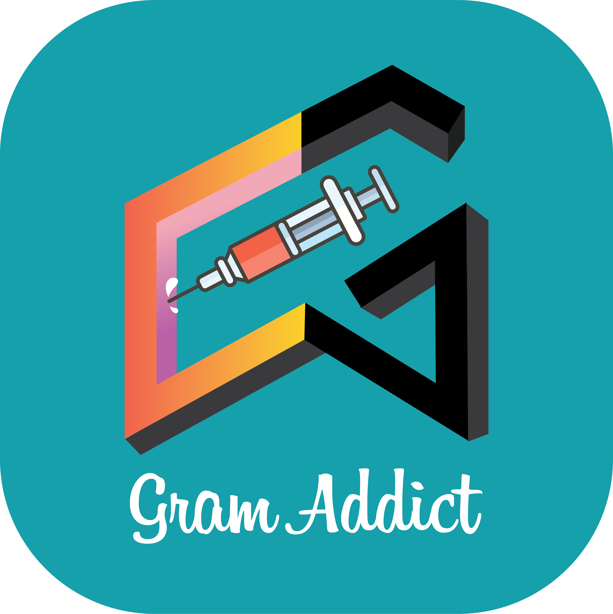

  
   
  <h1 style="text-align: center;">GramAddict</h1>
   
  
Looking for Instagram automation? I'm proud to present you a <b>100% free and open source Instagram bot</b>. This bot will allow you to grow your following and engagement by liking, following, commenting and sending PM automatically with your Android phone/tablet/emulator. <b>No root required.</b> 

  

    
    
    
    
    
    
    
      
    
  

 

  

 

## Introduction
This bot can do almost everything that you can do on the app, but automatically. You don't need to root your phone: it works on [uiautomator2](https://github.com/openatx/uiautomator2), which is a framework for testing apps behaviour in devices.

## Why GramAddict?
There already is [InstaPy](https://github.com/timgrossmann/InstaPy), which works on the Instagram web version. Unfortunately, Instagram bots detection system has become very suspicious of browser actions. Now InstaPy and similar scripts work at most for an hour, then Instagram blocks possibility to do any further actions, and if you continue using InstaPy, it may ban your account. 

There is also [Insomniac](https://github.com/alexal1/Insomniac/) which is the origin of this project, but there were issues that cropped up when the project organizers decided to monetize it. We wanted to keep this project completely free and open source so we forked it! Now this project is the better option. 😇 [Comparison](Comparison.md) (coming soon)

Our objective is to make a completely free automation solution for Android mobile devices and emulators. Instagram can't distinguish a bot from a human when it comes to your phone. However, even a human can reach limits when using the app, so make sure you are careful with your limits. 
From version 2.0 there are a lot of limits and features you can set to avoid getting soft banned: For example, we introduced a time scheduler that will help you to set a few intervals where you want to run the bot.
Always set the total limits so you will be in the safe zone.
We also provide a config example file that you can use as a starting reference point for your account.

## Features
- Works without rooting
- Works with both emulators and physical devices
- Can be used stand-alone (without the use of a computer)
- Includes realistic random human-like delays and actions
- Can watch stories while interacting
- Comment post with emojis and [spintax logic](https://github.com/GramAddict/docs/blob/main/configuration.md#spintax-support)
- Send PM
- Type like a human (letter by letter by faking using suggestions. For example you won't type `H - e - l - l - o` letter by letter but something like `H - He - Hello`)
- Browse carousels and watch their contents
- Watch videos for a specific amount of time
- Scheduler
- Getting tasty telegram reports
- Supports multiple actions in one session
- Lots of customizable limits to keep your account safe from soft bans
- Available interactions
    - interact with a user's followers or following
    - interact with a top or recent hashtag's post likers
    - interact with a top or recent hashtag post
    - interact with a top or recent place's post likers
    - interact with a top or recent place post
    - interact with user's post likers
    - interact with a single blogger
    - interact with your feed
    - interact with users from a list (*.txt)
    - interact with posts from links inside a list (*.txt)
    - unfollow any followers
    - unfollow any followers, followed by bot
    - unfollow any followers, followed by bot, who don't follow you back
    - unfollow from a list (*.txt)
    - scrape mode for collecting usernames instead of interacting with them (you will find more information about that in the doc)

- Lots of available filters to customize who you interact with
    - you can blacklist people to avoid interacting with them
    - you can whitelist people to not remove them when you unfollow people
    - biography main characters and language
    - profile name main characters
    - private / public / business / non business account
    - number of posts / followers / following
    ... and more!

## Contributors

This project exists thanks to all of our Contributors [[Contribute](https://docs.gramaddict.org/#/contributing)].

 

## Backers

Thank you to everyone that supports us financially! 🙏 [[Become a backer](https://opencollective.com/gramaddict#backer)]

 
From version 1.2.3 (Jannuary 2021) this bot is maintained and supported only by me, for free.
If you like my work consider making a small donation..

## Talk Botty With Us

  

---

> **Disclaimer**<a name="disclaimer" />: This project comes with no guarantee or warranty. You are responsible for whatever happens from using this project. It is possible to get soft or hard banned by using this project if you are not careful.
